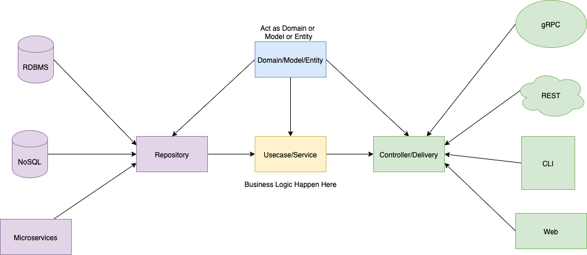

# backend code base template

## Clean Architecture
Clean Architecture is a design pattern that uses the concept of "separation of layers.
Using abstraction will make it easier for us to do unit testing, and by applying Domain-Driven Design (DDD), one applies a domain layer that holds just the business logic. 
The benefits become apparent when we refactor code to cater to changing requirements and eliminate technical debt. With Clean Architecture, we change one part of the code with minimal impact on any dependent code.
You can always mock the abstraction and change its dependencies without changing other parts of the code when it becomes obsolete or needs refactoring.
clean architecture is made of four circles

- Independent of Frameworks. The architecture does not depend on the existence of some library of feature laden software. This allows you to use such frameworks as tools, rather than having to cram your system into their limited constraints.
- Testable. The business rules can be tested without the UI, Database, Web Server, or any other external element.
- Independent of UI. The UI can change easily, without changing the rest of the system. A Web UI could be replaced with a console UI, for example, without changing the business rules.
- Independent of Database. You can swap out Oracle or SQL Server, for Mongo, BigTable, CouchDB, or something else. Your business rules are not bound to the database.
- Independent of any external agency. In fact your business rules simply don’t know anything at all about the outside world.

## Project Layers:
This project has 4 Domain layer :

    Entities (Models)
    Usecase (Repository)
    Controller (Usecase)
    Framework & Driver (Delivery)

## The diagram:

A repository is a layer connecting the app and the unknown part outside the app. For the backend, the storage should be the part where the app talks with the database, stores the data, etc.
After that, we have a UseCase layer. It is a layer where we connect between the UI or Delivery layer and the Repository layer. This layer is used to control the data we use, and some people also call this layer a Controller layer. 
Next is the Entities layer, which stores the interface and abstraction from request, response, and data. 
Finally, we have the Delivery layer, sometimes called the handler layer. It is the layer that sends data to the outside world.

## Directory structure :

export BACKEND_CODE_BASE_DEBUG=true
export BACKEND_CODE_BASE_PORT=8080
export BACKEND_CODE_BASE_DB_PORT=5432
export BACKEND_CODE_BASE_DB_USER=postgres
export BACKEND_CODE_BASE_DB_PASSWORD=tech@123
export BACKEND_CODE_BASE_DB_HOST=localhost
export BACKEND_CODE_BASE_DB_DATABASE=access_control
export BACKEND_CODE_BASE_ACCEPTED_VERSIONS=v1,v2,v3 
export BACKEND_CODE_BASE_DB_SCHEMA=public

export BACKEND_CODE_BASE_MIGRATION_PATH=file:///home/athira/Documents/BeTheChange/accessControl/backend-code-base-template-main/migrations/scripts/

