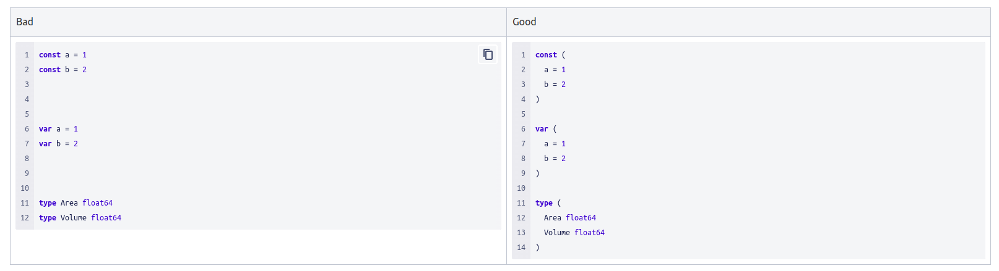
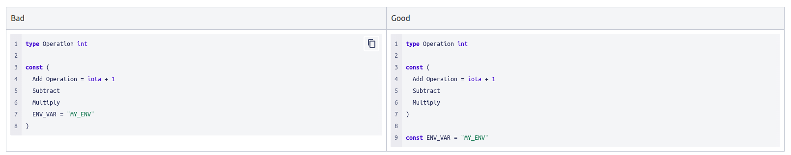
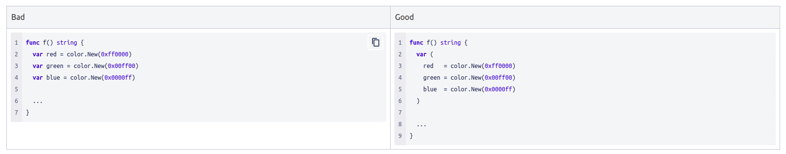

## Wrapping Function Signatures
When wrapping function signatures that do not fit on one line, put the name, arguments, and return types on separate lines, with the closing ) at the same indentation as func (this helps visually separate the indented arguments from the indented function body). Example:

```go
    func (s *someType) myFunctionName(
        arg1 somepackage.SomeArgType, arg2 int, arg3 somepackage.SomeOtherType,
    ) (somepackage.SomeReturnType, error) {
    ...
    }
```


If the arguments list is too long to fit on a single line, switch to one argument per line:

```go
    func (s *someType) myFunctionName(
        arg1 somepackage.SomeArgType,
        arg2 int,
        arg3 somepackage.SomeOtherType,
    ) (somepackage.SomeReturnType, error) {
    ...
    }
```

If the return types need to be wrapped, use the same rules:

```go
    func (s *someType) myFunctionName(
        arg1 somepackage.SomeArgType, arg2 somepackage.SomeOtherType,
    ) (
    somepackage.SomeReturnType,
    somepackage.SomeOtherType,
    error,
    ) {
    ...
    }
```


## Group Similar Declarations
Go supports grouping similar declarations.


This also applies to constants, variables, and type declarations.


Only group related declarations. Do not group declarations that are unrelated.


Groups are not limited in where they can be used. For example, you can use them inside of functions.


